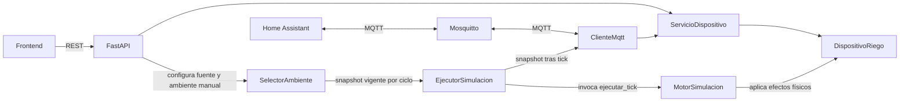

# Arquitectura

## Alcance

El sistema representa un dispositivo de riego stateful que se ejecuta como un único
proceso. FastAPI, MQTT, Home Assistant y el frontend exponen distintas formas de observar
u operar la misma instancia de `DispositivoRiego`.

La separación es por responsabilidades entre dominio, aplicación, adaptadores e
infraestructura. No se presenta como una implementación completa de DDD, arquitectura
hexagonal o procesamiento distribuido.

## Componentes

| Componente | Responsabilidad |
|---|---|
| `DispositivoRiego` | Mantener estado y aplicar operaciones físicas básicas |
| `ServicioDispositivo` | Serializar acceso al dispositivo y aplicar la política de control manual |
| `MotorSimulacion` | Ejecutar el tick físico: calcular sus efectos y aplicarlos al dispositivo |
| `EjecutorSimulacion` | Coordinar el reloj: consultar el ambiente, tomar el lock, invocar el motor y notificar al terminar |
| `SelectorAmbiente` | Recibir la configuración ambiental de la API y entregar al ejecutor un snapshot coherente por ciclo |
| `AmbienteManual` | Guardar las condiciones configuradas por el usuario |
| `AmbienteAleatorio` | Generar una vez las condiciones aleatorias de la ejecución |
| Rutas FastAPI | Traducir contratos HTTP a enums y operaciones de aplicación |
| `ClienteMqtt` | Gestionar conexión, comandos, estado, availability y Discovery |
| `principal.py` | Construir las instancias y coordinar su ciclo de vida |
| Frontend | Consultar la API, renderizar respuestas y enviar comandos REST |

## Dependencias y fuente de verdad



`DispositivoRiego` es la fuente de verdad del dispositivo. Los payloads MQTT, las
respuestas REST, las entidades de Home Assistant y el DOM son representaciones de ese
estado; ninguno decide transiciones físicas por su cuenta.

El ambiente tiene estado separado porque es una entrada de la simulación. El
`SelectorAmbiente` mantiene la fuente activa y el perfil manual, pero no replica el
estado del dispositivo.

## Concurrencia

`principal.py` crea un único `Lock` para el dispositivo. La misma instancia se entrega a
`ServicioDispositivo` y `EjecutorSimulacion`:

- REST y MQTT acceden al dominio mediante `ServicioDispositivo` y toman el lock.
- El ejecutor toma ese mismo lock durante el tick completo.
- La publicación MQTT posterior al tick ocurre fuera del lock.
- `SelectorAmbiente` tiene un lock propio para seleccionar la fuente y leer o reemplazar
  las condiciones manuales de forma coherente.

Así, un comando externo no puede intercalarse a mitad de un tick. No existe coordinación
entre procesos: ejecutar más de un worker crearía dispositivos independientes, por eso el
Dockerfile fija `--workers 1`.

## Dominio y simulación

El dispositivo mantiene:

- modo `AUTOMATICO` o `MANUAL`;
- válvula `ABIERTA` o `CERRADA`;
- velocidad `BAJA`, `MEDIA` o `ALTA`;
- humedad del suelo y nivel de agua entre `0` y `100`;
- humedad mínima menor que la humedad objetivo.

Los umbrales se definen al construir el dispositivo y son de solo lectura en el MVP.

### Política de válvula

En `AUTOMATICO`, cada tick aplica esta política:

| Condición | Resultado |
|---|---|
| Tanque vacío | Cierra la válvula |
| Humedad menor que el mínimo y hay agua | Abre la válvula |
| Humedad mayor o igual al objetivo | Cierra la válvula |
| Humedad entre mínimo y objetivo | Conserva el estado actual |

El rango intermedio introduce histéresis. Cambiar a `AUTOMATICO` solo cambia el modo; la
política se evalúa en el siguiente tick. Cambiar a `MANUAL` conserva el estado físico de
la válvula.

`ServicioDispositivo` permite cambiar la velocidad en ambos modos, pero solo permite
operar directamente la válvula en `MANUAL`. `DispositivoRiego` impide abrirla sin agua y
la cierra si el tanque se agota.

### Tick y coordinación temporal

La API modifica la fuente o el perfil manual mediante `SelectorAmbiente`. Cada segundo,
`EjecutorSimulacion` solicita al selector el snapshot vigente, toma el lock compartido e
invoca `MotorSimulacion.ejecutar_tick()`.

El cálculo y la aplicación del tick pertenecen al motor:

```text
delta_humedad = aporte_riego + aporte_lluvia - secado
```

El secado parte de `0.10` y suma factores discretos de temperatura, humedad ambiental y
radiación. La lluvia aporta entre `0.00` y `1.20` puntos por tick. Con la válvula abierta,
el riego aporta `0.50`, `1.00` o `1.50`, y consume `0.05`, `0.10` o `0.15` del tanque según
la velocidad. Si queda menos agua que la prevista, el aporte se reduce proporcionalmente.

El resultado de humedad se limita a `0..100`. Al regresar el motor, el ejecutor libera el
lock y notifica el snapshot completo a MQTT. El modelo es intencionalmente sencillo y no
representa evapotranspiración agronómica real.

### Ambiente

`AmbienteAleatorio` genera temperatura, humedad ambiental, radiación y lluvia al iniciar;
esas condiciones permanecen fijas durante la ejecución. Con un `Random` sembrado es
reproducible en tests, pero una ejecución normal obtiene un escenario inicial diferente.

`AmbienteManual` guarda un snapshot completo. La API solo permite reemplazarlo cuando la
fuente activa es `MANUAL`. Cambiar de fuente no ejecuta un tick: el ejecutor observa la
selección vigente en su siguiente iteración.

## REST

Las rutas de `src/api/` reciben modelos Pydantic con campos públicos en inglés. Los enums
HTTP utilizan nombres como `ALTA`, aunque el enum interno `VelocidadRiego.ALTA` tenga el
valor numérico `3`.

| Método | Ruta | Entrada relevante |
|---|---|---|
| `GET` | `/api/device` | Sin body |
| `PATCH` | `/api/device/mode` | `{"mode":"AUTOMATICO|MANUAL"}` |
| `PATCH` | `/api/device/speed` | `{"speed":"BAJA|MEDIA|ALTA"}` |
| `PATCH` | `/api/device/valve` | `{"state":"ABIERTA|CERRADA"}` |
| `GET` | `/api/environment` | Sin body |
| `GET` | `/api/environment/source` | Sin body |
| `PATCH` | `/api/environment/source` | `{"source":"ALEATORIO|MANUAL"}` |
| `GET` | `/api/environment/manual` | Sin body |
| `PUT` | `/api/environment/manual` | Snapshot ambiental completo |

Las respuestas de error tienen la forma:

```json
{
  "code": "VALVE_CONTROL_REQUIRES_MANUAL_MODE",
  "message": "La válvula solo puede controlarse en modo manual",
  "fields": null
}
```

Los códigos implementados son `VALIDATION_ERROR`, `MANUAL_ENVIRONMENT_REQUIRED`,
`VALVE_CONTROL_REQUIRES_MANUAL_MODE`, `RESOURCE_NOT_FOUND`, `METHOD_NOT_ALLOWED` e
`INTERNAL_ERROR`. Los errores inesperados se registran y la respuesta no incluye la
excepción interna.

Un comando REST devuelve el estado actualizado, pero no dispara directamente una
publicación MQTT. El siguiente tick publica el snapshot completo, por lo que Home
Assistant observa el cambio con una demora máxima aproximada de un intervalo de
simulación mientras el broker esté conectado.

## MQTT y Home Assistant

`ClienteMqtt` usa Eclipse Paho con Callback API VERSION2 y QoS 1. Los comandos se
traducen a enums y pasan por `ServicioDispositivo`; un payload inválido o una regla de
negocio rechazada se registra sin detener el loop.

### Topics operativos

| Topic | Dirección | QoS | Retain emitido por el simulador | Propósito |
|---|---|---:|---|---|
| `smart-irrigation/device/state` | simulador → broker | 1 | Sí | Snapshot completo |
| `smart-irrigation/device/mode/set` | broker → simulador | 1 al suscribirse | — | Cambiar modo |
| `smart-irrigation/device/speed/set` | broker → simulador | 1 al suscribirse | — | Cambiar velocidad |
| `smart-irrigation/device/valve/set` | broker → simulador | 1 al suscribirse | — | Operar válvula |
| `cuby/irrigation/availability` | simulador → broker | 1 | Sí | `online` / `offline` |
| `homeassistant/status` | broker → simulador | 1 al suscribirse | — | Detectar arranque de HA |

El guion en la columna retain indica que el simulador recibe el mensaje y no controla
la opción retain elegida por quien publica el comando.

Payload representativo de estado:

```json
{
  "mode": "AUTOMATICO",
  "valve": "CERRADA",
  "irrigation_speed": "MEDIA",
  "soil_moisture": 42.7,
  "water_level": 76.4,
  "minimum_moisture": 30.0,
  "target_moisture": 60.0,
  "temperature": 25.0,
  "ambient_humidity": 50.0,
  "radiation": "MEDIA",
  "rain": "NINGUNA"
}
```

### Discovery

Al conectar, el simulador publica retained once configuraciones Discovery:

```text
homeassistant/select/cuby_irrigation/mode/config
homeassistant/select/cuby_irrigation/speed/config
homeassistant/switch/cuby_irrigation/valve/config
homeassistant/sensor/cuby_irrigation/soil_moisture/config
homeassistant/sensor/cuby_irrigation/water_level/config
homeassistant/sensor/cuby_irrigation/minimum_moisture/config
homeassistant/sensor/cuby_irrigation/target_moisture/config
homeassistant/sensor/cuby_irrigation/temperature/config
homeassistant/sensor/cuby_irrigation/ambient_humidity/config
homeassistant/sensor/cuby_irrigation/radiation/config
homeassistant/sensor/cuby_irrigation/rain/config
```

Los identifiers conservan el prefijo histórico `cuby_irrigation` para no crear entidades
duplicadas en instalaciones existentes. El nombre visible del dispositivo es
`Smart Irrigation`.

### Conexión y resincronización

El lifespan de FastAPI inicia primero `ClienteMqtt` y después `EjecutorSimulacion`.
`connect_async()` y el loop en background permiten que la API y la simulación arranquen
aunque Mosquitto todavía no acepte conexiones.

Al conectar o reconectar, el cliente:

1. se suscribe a los tres comandos y a `homeassistant/status`;
2. publica availability `online` retained;
3. publica Discovery retained;
4. publica el estado actual retained.

El LWT publica `offline` retained ante una desconexión inesperada. En un cierre limpio,
el cliente intenta publicar `offline`, espera hasta un segundo su confirmación y se
desconecta.

Mientras no hay conexión, las publicaciones se descartan; no existe una cola local. La
simulación continúa y el snapshot vigente se publica cuando Paho vuelve a conectar. Si
Home Assistant publica `online` en `homeassistant/status`, el cliente vuelve a publicar
Discovery y estado.

## Frontend

FastAPI registra primero las rutas `/api/*` y después monta `frontend/` en `/` mediante
`StaticFiles`. El navegador no se conecta directamente a MQTT.

El frontend usa HTML, CSS y un único `main.js`. El archivo está separado por bloques de
API, referencias DOM, render, feedback, eventos, polling y bootstrap; no se dividió en
módulos porque la interfaz sigue siendo una sola pantalla.

Cada ciclo de polling espera las respuestas y programa el siguiente con `setTimeout` a
1.5 segundos, evitando timers solapados. El DOM se actualiza desde respuestas del backend.
Después de un comando se renderiza la respuesta y se ejecuta un refresh; los errores se
interpretan mediante `code`. La válvula se deshabilita visualmente en modo automático y
el formulario ambiental solo se habilita en `MANUAL`, sin sustituir la validación del
backend.

## Docker

Compose utiliza su red default y el DNS por nombre de servicio.

| Servicio | Imagen/Build | Puerto host | Persistencia |
|---|---|---|---|
| `simulator` | Dockerfile del repositorio | `127.0.0.1:8000` | Estado en memoria |
| `mosquitto` | `eclipse-mosquitto:2` | No publicado | Volumen `/mosquitto/data` |
| `home-assistant` | Imagen oficial `stable` | `127.0.0.1:8123` | Volumen `/config` |

Compose inyecta `MQTT_HOST=mosquitto`, `MQTT_PORT=1883` y
`MQTT_CLIENT_ID=smart-irrigation-simulator`. Sin esas variables,
`ConfiguracionMqtt.desde_entorno()` usa `localhost:1883`.

`depends_on` define orden de creación, no readiness. No se añadieron healthchecks ni
scripts de espera porque la conexión MQTT se reintenta en background.

Mosquitto permite conexiones anónimas, persiste retained messages y escribe logs en
stdout. El puerto 1883 solo está disponible dentro de la red Compose.

Home Assistant requiere onboarding y configuración manual de la integración MQTT con
broker `mosquitto`. Discovery y sus entidades son reproducibles desde el código. Usuarios,
credenciales y dashboards creados en la UI permanecen en el volumen local y no se
versionan.

## Decisiones y trade-offs

- **Dominio separado de transportes.** Facilita probar reglas sin FastAPI ni MQTT, a
  cambio de introducir traducciones entre enums internos y contratos públicos.
- **Servicio compartido.** REST y MQTT aplican la misma política de válvula y el mismo
  lock. La simulación usa directamente el dominio porque ejecuta operaciones físicas.
- **Un dispositivo por proceso.** Evita coordinación distribuida; no permite escalar
  workers sin rediseñar identidad y persistencia.
- **Estado efímero.** Reiniciar el simulador restaura valores iniciales. Mosquitto y Home
  Assistant sí persisten los datos operativos que necesitan.
- **JavaScript vanilla.** Evita un build frontend para una pantalla pequeña, pero un
  crecimiento sustancial justificaría separar `main.js`.
- **Broker abierto solo en la demo.** Simplifica el arranque local; producción requiere
  autenticación, ACL, TLS y gestión de secretos.

## Pruebas y límites

La suite cubre reglas del dispositivo, cálculos del motor, coordinación del tick, locks,
fuentes ambientales, contratos REST/OpenAPI, errores HTTP y comportamiento del cliente
MQTT mediante dobles de Paho. También se realizó validación manual del stack, pero no hay
un test end-to-end automatizado que arranque Compose y opere Home Assistant.

Límites actuales:

- no hay persistencia ni recuperación del estado físico del dispositivo;
- no existen autenticación ni cifrado MQTT;
- no hay telemetría histórica ni soporte multi-dispositivo;
- los umbrales no se modifican mediante API o MQTT;
- el dashboard personalizado de Home Assistant no se distribuye desde Git;
- no se garantiza entrega de snapshots generados mientras MQTT está desconectado.
